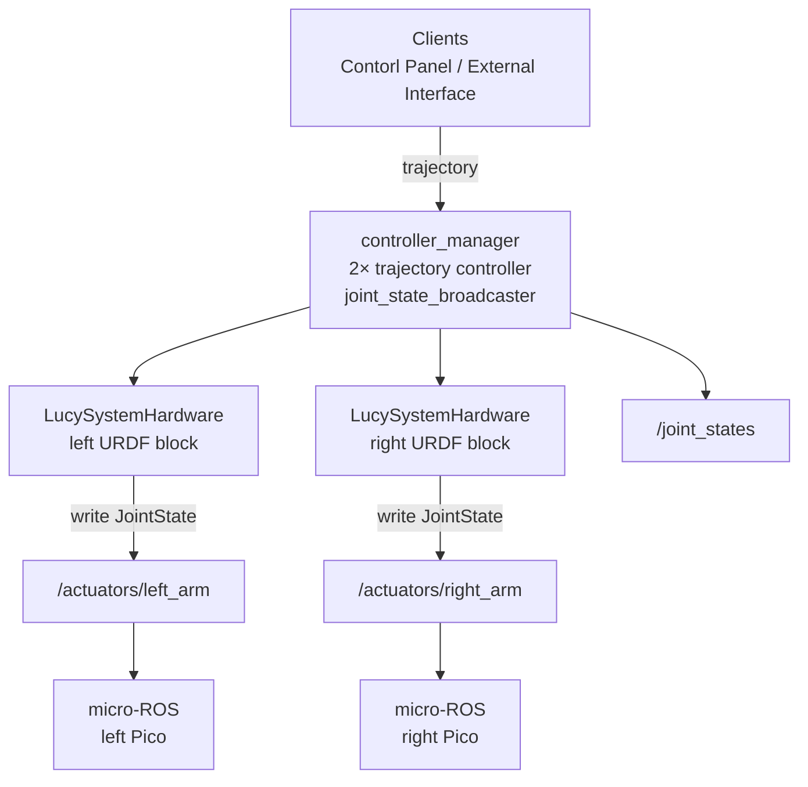

# ros2_control on Lucy (`lucy_ros_packages` + `thais_urdf`)

ROS 2 **Humble**. This document explains **ros2_control**, and how it is implemented in Lucy: hardware plugin, topics, YAML, and launch files. URDF / xacro for `ros2_control` blocks live in **`thais_urdf`**; plugin binary and controller YAML live in **`lucy_ros2_control`**.

**Related:** [`DEVELOPER.md`](DEVELOPER.md) (repo layout, CI), [`../thais_urdf/docs/DEVELOPER.md`](../../thais_urdf/docs/DEVELOPER.md) (URDF, sim launches).

---

## 1. What is ros2_control ?

**ros2_control** is the layer between **high-level motion** (trajectories, teleop, UIs) and **hardware** (or sim). Typical components:

| Component | Role |
|--------|------|
| **Controller manager** | Loads controllers, runs update loop at `update_rate`. |
| **Controllers** | Consume commands / goals and write **command interfaces** (e.g. position) on hardware handles. |
| **Broadcasters** | Read **state interfaces** and publish ROS messages (e.g. **`joint_state_broadcaster`** → `/joint_states`). |
| **Hardware interface (plugin)** | Maps command/state buffers to real devices or sim (`read()` / `write()` each cycle). |

Clients (MoveIt, web panel, scripts) usually talk to **controllers** (e.g. `FollowJointTrajectory` on a `joint_trajectory_controller`), not directly to microcontrollers. The hardware plugin is responsible for whatever the real stack needs (CAN, EtherCAT, or—in Lucy’s case—ROS topics consumed by micro-ROS on RP2040 boards).

---

## 2. Lucy: components and packages

| Asset | Package | Notes |
|--------|---------|--------|
| **`LucySystemHardware`** | `lucy_ros2_control` | `hardware_interface::SystemInterface` plugin; publishes actuator commands for **real** hardware. |
| **`lucy_controllers.yaml`** | `lucy_ros2_control` | Declares `controller_manager`, broadcasters, `left_arm_controller` / `right_arm_controller` (`JointTrajectoryController`). |
| **`control.launch.py`** | `lucy_ros2_control` | `robot_state_publisher` + `ros2_control_node` + spawners. |
| **`<ros2_control>` xacro** | `thais_urdf` | Two **system** blocks (left/right arms), plugin `LucySystemHardware` or `gz_ros2_control/GazeboSimSystem`, plus `publisher_topic` / `node_name` params. |

Joint names in **`lucy_controllers.yaml`** (or generated **`thais_urdf`** `controllers.yaml`) must match the URDF / xacro **exactly**. Change YAML and **`thais_urdf`** together (see `docs/DEVELOPER.md` checklist).

---

## 3. Data flow (Lucy, real robot)

- **`/joint_states`**: fused state for **`robot_state_publisher`**, RViz, TF. Comes from **`joint_state_broadcaster`**, not from `/actuators/*`.
- **`/actuators/left_arm`** and **`/actuators/right_arm`**: command stream from **`LucySystemHardware::write()`**, **RELIABLE** QoS to match micro-ROS default subscribers.

---

## 4. Hardware plugin behavior (`LucySystemHardware`)

Configured per arm in **`thais_urdf`** → `inmoov/ros2_control/inmoov_ros2_control.xacro` (when `use_gazebo_sim:=false`):

- **Left:** `publisher_topic` = `actuators/left_arm`, `node_name` = `lucy_hardware_interface_left_arm`.
- **Right:** `publisher_topic` = `actuators/right_arm`, `node_name` = `lucy_hardware_interface_right_arm`.

Implementation notes (see `lucy_ros2_control/hardware/lucy_system.cpp`):

- **`read()`**: no encoders; **`hw_positions_`** is set from **`hw_commands_`** (state follows last command).
- **`write()`**: builds **`sensor_msgs/msg/JointState`** with **header** and **position** array only. Firmware expects **nine** positions per arm in bus order; the URDF lists ten arm joints per side, so **`left_shoulder_y_link_joint`** / **`right_shoulder_y_link_joint`** are **omitted** from the published array (wiring/bus mapping).
- **QoS**: publisher is **RELIABLE**; **BEST_EFFORT** would not match typical micro-ROS subscriptions.

Simulation (`use_gazebo_sim:=true`) uses **`gz_ros2_control/GazeboSimSystem`** instead—no `/actuators/*` traffic to Picos.

---

## 5. Launch entry points (what runs ros2_control)

| Launch | ros2_control | Typical extras |
|--------|--------------|----------------|
| **`ros2 launch lucy_bringup lucy.launch.py`** | Yes (after **3 s** delay via `control.launch.py`) | micro-ROS agents, rosbridge, cameras, RealSense |
| **`ros2 launch lucy_ros2_control control.launch.py`** | Yes | Minimal: `robot_state_publisher` only |
| **`ros2 launch thais_urdf rviz.launch.py`** | Yes | RViz, rosbridge |
| **`ros2 launch thais_urdf gazebo.launch.py`** | Yes (sim plugins) | Gazebo, RViz, rosbridge |

`lucy.launch.py` starts **`lucy_ros2_control`** **after** micro-ROS agents and rosbridge so serial and the web socket are up before the control node spikes load.

For **RViz alone** next to a running Jetson stack, see **`thais_urdf`** README: **`rviz_standalone.launch.py`**.

---

## 6. Web control panel

The panel sends trajectories to **`joint_trajectory_controller`** topics (defaults include **`/left_arm_controller/joint_trajectory`** and **`/right_arm_controller/joint_trajectory`**). That requires:

1. **Controllers** spawned and **active** (not only `joint_state_broadcaster`).
2. **`ros2_control_node`** running with **`LucySystemHardware`** (real) or Gazebo system (sim).

If managers or spawners failed, commands are published but **nothing updates command interfaces** → Picos see no new `/actuators/*` data.

---

## 7. Operational pitfalls (integration)

1. **Arm controllers inactive** — `write()` only runs when controllers drive those joints; verify **`left_arm_controller`** / **`right_arm_controller`** with `ros2 control list_controllers`.
2. **Sim URDF on hardware** — `LucySystemHardware` is absent when **`GazeboSimSystem`** is in the URDF; real Picos need `use_gazebo_sim:=false` in xacro.
3. **QoS** — keep actuator publishers **RELIABLE** for micro-ROS defaults.
4. **Cycle packaging** — `thais_urdf` does not `exec_depend` on `lucy_ros2_control`; install both packages in the same workspace/underlay so default `urdf_path` / controller YAML resolve.

---

## 8. File index (quick)

| Path | Purpose |
|------|---------|
| `lucy_ros2_control/hardware/*` | `LucySystemHardware` |
| `lucy_ros2_control/config/lucy_controllers.yaml` | Controllers + `extra_joints` for TF |
| `lucy_ros2_control/launch/control.launch.py` | Bringup snippet |
| `thais_urdf/inmoov/ros2_control/inmoov_ros2_control.xacro` | Plugins + joint list per arm |

Maintainers: align changes with **`../../thais_urdf/docs/DEVELOPER.md`** and control-panel joint config when joint order or names change.
