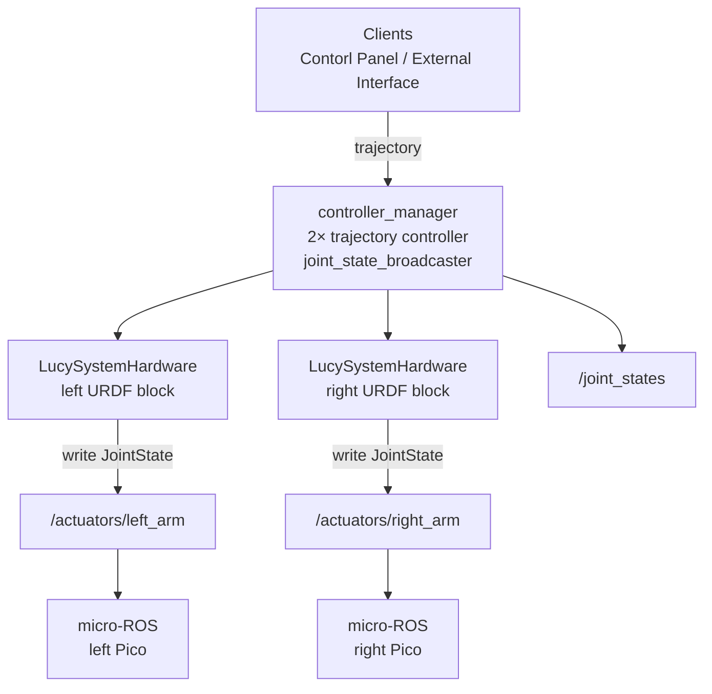

# ros2_control on Lucy (`lucy_ros_packages` + `thais_urdf`)

ROS 2 **Jazzy**. This document explains **ros2_control**, and how it is implemented in Lucy: hardware plugin, topics, YAML, and launch files. URDF / xacro for `ros2_control` blocks live in **`thais_urdf`**; plugin binary and controller YAML live in **`lucy_ros2_control`**.

**Related:** [`DEVELOPER.md`](DEVELOPER.md) (repo layout, CI), [`../thais_urdf/docs/DEVELOPER.md`](../../thais_urdf/docs/DEVELOPER.md) (URDF, sim launches).

---

## 1. What is ros2_control ?

**ros2_control** is the layer between **high-level motion** (trajectories, teleop, UIs) and **hardware** (or sim). Typical components:

| Component | Role |
|--------|------|
| **Controller manager** | Loads controllers, runs update loop at `update_rate`. |
| **Controllers** | Consume commands / goals and write **command interfaces** (e.g. position) on hardware handles. |
| **Broadcasters** | Read **state interfaces** and publish ROS messages (e.g. **`joint_state_broadcaster`** → `/joint_states`). |
| **Hardware interface (plugin)** | Maps command/state buffers to real devices or sim (`read()` / `write()` each cycle). |

Clients (MoveIt, web panel, scripts) usually talk to **controllers** (e.g. `FollowJointTrajectory` on a `joint_trajectory_controller`), not directly to microcontrollers. The hardware plugin is responsible for whatever the real stack needs (CAN, EtherCAT, or—in Lucy’s case—ROS topics consumed by micro-ROS on RP2040 boards).

---

## 2. Lucy: components and packages

| Asset | Package | Notes |
|--------|---------|--------|
| **`LucySystemHardware`** | `lucy_ros2_control` | `hardware_interface::SystemInterface` plugin; publishes actuator commands for **real** hardware. |
| **`lucy_controllers.yaml`** | `lucy_ros2_control` | Declares `controller_manager`, broadcasters, `left_arm_controller` / `right_arm_controller` (`JointTrajectoryController`). |
| **`control.launch.py`** | `lucy_ros2_control` | `robot_state_publisher` + `ros2_control_node` + spawners. |
| **`<ros2_control>` xacro** | `thais_urdf` | Two **system** blocks (left/right arms), plugin `LucySystemHardware` or `gz_ros2_control/GazeboSimSystem`, plus `publisher_topic` / `node_name` params. |

Joint names in **`lucy_controllers.yaml`** (or generated **`thais_urdf`** `controllers.yaml`) must match the URDF / xacro **exactly**. Change YAML and **`thais_urdf`** together (see `docs/DEVELOPER.md` checklist).

---

## 3. Data flow (Lucy, real robot)

- **`/joint_states`**: fused state for **`robot_state_publisher`**, RViz, TF. Comes from **`joint_state_broadcaster`**, not from `/actuators/*`.
- **`/actuators/left_arm`** and **`/actuators/right_arm`**: command stream from **`LucySystemHardware::write()`**, **RELIABLE** QoS to match micro-ROS default subscribers.

---

## 4. Hardware plugin behavior (`LucySystemHardware`)

`LucySystemHardware` is the only ros2_control plugin Lucy ships. The same plugin is selected for **real** and **mock/RViz** hardware; only Gazebo uses a different plugin (`gz_ros2_control/GazeboSimSystem`).

| `use_gazebo_sim` | `use_mock_hardware` | Plugin selected | `publish_actuators` |
|------------------|---------------------|-----------------|---------------------|
| `false` | `false` | `lucy_ros2_control/LucySystemHardware` | `true` (default) |
| `false` | `true`  | `lucy_ros2_control/LucySystemHardware` | `false` |
| `true`  | *any*   | `gz_ros2_control/GazeboSimSystem` | n/a |

Per-arm parameters (xacro, real hardware path):

- **Left:** `publisher_topic = actuators/left_arm`, `node_name = lucy_hardware_interface_left_arm`.
- **Right:** `publisher_topic = actuators/right_arm`, `node_name = lucy_hardware_interface_right_arm`.

Implementation (`lucy_ros2_control/src/lucy_system.cpp`):

- **`on_init()`** is a thin orchestrator over four steps, each a small member function: `validate_joints()` (interface checks), `configure_publisher()` (params + node/publisher), `init_joint_limits()` and `init_actuator_mappings()`. The side-effect-free parsing/validation/mapping core lives in `src/joint_config.{hpp,cpp}` (no live ROS node) and is unit-tested directly. `on_init` parses, per joint:
  - The actuator mapping (`offset_deg`, `direction`, `scale`, `servo_min/max/default_deg`).
  - URDF position envelope from `<command_interface name="position"><param name="min/max"/></command_interface>` (radians) into `joint_min_rad_` / `joint_max_rad_`.
  - The `publish_actuators` boolean (defaults to `true`).
- **`read()`**: no encoders → `hw_positions_` mirrors the last clamped command.
- **`write()`** (in order):
  1. **URDF clamp** — every `hw_commands_[i]` is clamped to `[joint_min_rad_[i], joint_max_rad_[i]]`. `/joint_states` and the actuator publisher both reflect the clamped value, so out-of-range commands from MoveIt / LCP / CLI plateau at the URDF wall.
  2. **Mock short-circuit** — if `publish_actuators_` is `false`, return after the clamp (no micro-ROS traffic). RViz/mock therefore enforces URDF limits the same way as real hardware, without spamming `/actuators/*`.
  3. **Actuator mapping** — `joint_rad → joint_deg → servo_deg` via `(joint_deg / (direction*scale)) + offset_deg`, then clamped to `[servo_min_deg, servo_max_deg]` (`actuator_command_to_servo_rad()` in `joint_config`).
  4. **Publish** — `sensor_msgs/msg/JointState` (header + position only) at **RELIABLE** QoS to match micro-ROS defaults. Firmware expects **nine** positions per arm in bus order, so `left_shoulder_y_link_joint` / `right_shoulder_y_link_joint` are omitted from the arm publishers (those are torso joints).

The same clamp helper (`src/include/position_limit_clamp.hpp`) is reused for the actuator-frame clamp.

> **Gazebo caveat.** `gz_ros2_control` (upstream `jazzy`) does **not** apply the `<command_interface><param name="min/max">` values inside `write()`. Gazebo may still respect joint limits coming from the spawned model/physics, but ros2_control-level URDF clamping in this repo is enforced by `LucySystemHardware` only. If consistent clamping in Gazebo becomes a hard requirement, the path is to either patch `gz_ros2_control` locally or wire `joint_limits_interface::PositionJointSaturationHandle` on the controllers.

---

## 5. Launch entry points (what runs ros2_control)

| Launch | ros2_control | Typical extras |
|--------|--------------|----------------|
| **`ros2 launch lucy_bringup lucy.launch.py`** | Yes (after **3 s** delay when not sim) | Always **`web_ros_api`**; **`real`** → micro-ROS + cameras; **`rviz`**; **`gazebo:=true` `real:=false`** → sim |
| **`ros2 launch lucy_ros2_control control.launch.py`** | Yes | Minimal: `robot_state_publisher` only |
| **`ros2 launch thais_urdf control.launch.py`** + **`rviz_standalone`** | Yes | Two processes: control stack, then RViz only (no rosbridge) |
| **`ros2 launch thais_urdf gazebo.launch.py`** | Yes (sim plugins) | Gazebo; optional RViz via **`start_rviz`** (no rosbridge) |

`lucy.launch.py` starts **`web_ros_api`** first, then (when **`real:=true`**) micro-ROS agents, then after **3 s** includes **`thais_urdf`** **`control.launch.py`** when **`gazebo:=false`**, so serial and the web socket are up before the control node spikes load.

For **RViz alone** next to a running Jetson stack, see **`thais_urdf`** README: **`rviz_standalone.launch.py`**.

---

## 6. Web control panel

The panel sends trajectories to **`joint_trajectory_controller`** topics (defaults include **`/left_arm_controller/joint_trajectory`** and **`/right_arm_controller/joint_trajectory`**). That requires:

1. **Controllers** spawned and **active** (not only `joint_state_broadcaster`).
2. **`ros2_control_node`** running with **`LucySystemHardware`** (real) or Gazebo system (sim).

If managers or spawners failed, commands are published but **nothing updates command interfaces** → Picos see no new `/actuators/*` data.

---

## 7. Operational pitfalls (integration)

1. **Arm controllers inactive** — `write()` only runs when controllers drive those joints; verify **`left_arm_controller`** / **`right_arm_controller`** with `ros2 control list_controllers`.
2. **Sim URDF on hardware** — `LucySystemHardware` is absent when **`GazeboSimSystem`** is in the URDF; real Picos need `use_gazebo_sim:=false` in xacro.
3. **QoS** — keep actuator publishers **RELIABLE** for micro-ROS defaults.
4. **Cycle packaging** — `thais_urdf` does not `exec_depend` on `lucy_ros2_control`; install both packages in the same workspace/underlay so default `urdf_path` / controller YAML resolve.
5. **URDF limits invisible at runtime** — `lucy_config_generator` must run before bringup so `<param name="min/max"/>` actually lands in the installed `inmoov_ros2_control.xacro`. Use the **GENERATE** step in the LCP activate workflow (or `ros2 service call /lucy_control/configure_pipeline …`) — see [§9](#9-config-pipeline-and-the-generate-step).
6. **Gazebo over-travel** — see the caveat at the end of §4.

---

## 8. File index (quick)

| Path | Purpose |
|------|---------|
| `lucy_ros2_control/src/lucy_system.cpp` | `LucySystemHardware` plugin (lifecycle, read/write) |
| `lucy_ros2_control/src/joint_config.{hpp,cpp}` | Pure on_init helpers: parsing, validation, actuator mapping, joint↔servo math |
| `lucy_ros2_control/src/include/position_limit_clamp.hpp` | Shared URDF / actuator-frame clamp |
| `lucy_ros2_control/test/test_position_limit_clamp.cpp` | gtest pinning the clamp algorithm |
| `lucy_ros2_control/test/test_joint_config.cpp` | gtest for the joint_config helpers |
| `lucy_ros2_control/config/lucy_controllers.yaml` | Controllers + `extra_joints` for TF |
| `lucy_ros2_control/launch/control.launch.py` | Bringup snippet |
| `lucy_config_generator/lucy_config_generator/templates/ros2_control.xacro.j2` | Source of `<param name="min/max"/>` and plugin selection |
| `lucy_config_generator/test/test_position_limits_unified.py` | URDF limits propagate to all `<command_interface>` blocks |
| `thais_urdf/description/ros2_control/inmoov_ros2_control.xacro` | Generated artefact: plugins + joint list per board |

Maintainers: align changes with **`../../thais_urdf/docs/DEVELOPER.md`** and control-panel joint config when joint order or names change.

---

## 9. Config pipeline and the GENERATE step

`lucy_config_pipeline` exposes the `ConfigurePipeline` action. The internal phases are now:

1. **VALIDATE** — schema-check `config/hardware/active.yaml`.
2. **GENERATE** — `lucy_config_generator` regenerates `inmoov_ros2_control.xacro` and `controllers.yaml` from the YAML and installs them into `thais_urdf/description/...` and `thais_urdf/config/...`. **Always runs**, including in `simulation_only` mode where BUILD/FLASH are skipped.
3. **BUILD** *(optional, skipped in `simulation_only`)* — compiles the RP2040 firmware C generated alongside the xacro.
4. **FLASH** *(optional, skipped in `simulation_only`)* — `sudo picotool` of the new firmware images.
5. **RELOAD** — calls `/lucy_control/restart` to re-read URDF + controller YAML; for Gazebo topology changes a relaunch is still required.

Decoupling GENERATE from BUILD means the LCP "SIMULATION ONLY" toggle can update URDF limits, joint names, and controller wiring without touching firmware. Real-hardware runs include all five phases.
