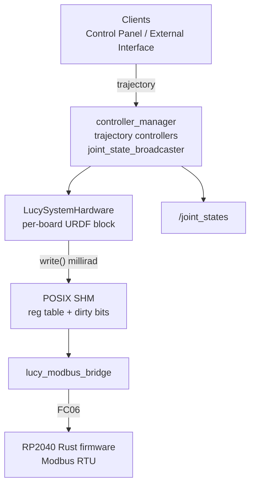

# ros2_control on Lucy (`lucy_ros_packages` + robot URDF)

ROS 2 **Jazzy**. This document explains **ros2_control**, and how it is implemented in Lucy: hardware plugin, SHM/Modbus path, YAML, and launch files. URDF / xacro for `ros2_control` blocks live in the active robot package (e.g. **`thais_urdf`** / **`inmoov_urdf`**); plugin binary and shared helpers live in **`lucy_ros2_control`**.

**Related:** [`DEVELOPER.md`](DEVELOPER.md) (repo layout, CI), robot-package `docs/DEVELOPER.md` for URDF / sim launches.

---

## 1. What is ros2_control ?

**ros2_control** is the layer between **high-level motion** (trajectories, teleop, UIs) and **hardware** (or sim). Typical components:

| Component | Role |
|--------|------|
| **Controller manager** | Loads controllers, runs update loop at `update_rate`. |
| **Controllers** | Consume commands / goals and write **command interfaces** (e.g. position) on hardware handles. |
| **Broadcasters** | Read **state interfaces** and publish ROS messages (e.g. **`joint_state_broadcaster`** → `/joint_states`). |
| **Hardware interface (plugin)** | Maps command/state buffers to real devices or sim (`read()` / `write()` each cycle). |

Clients (MoveIt, web panel, scripts) usually talk to **controllers** (e.g. `FollowJointTrajectory` on a `joint_trajectory_controller`), not directly to microcontrollers. On Lucy, the hardware plugin writes a **shared-memory register table**; **`lucy_modbus_bridge`** relays dirty registers as **Modbus RTU** over USB CDC to the Rust RP2040 firmware.

---

## 2. Lucy: components and packages

| Asset | Package | Notes |
|--------|---------|--------|
| **`LucySystemHardware`** | `lucy_ros2_control` | `hardware_interface::SystemInterface` plugin; SHM register table for **real** hardware. |
| **`lucy_modbus_bridge`** | `lucy_modbus_bridge` | Polls SHM dirty bits → Modbus FC06 writes on the board USB serial. |
| **Controllers YAML** | robot package (`config/controllers.yaml`) | Generated by `lucy_config_generator` / pipeline. |
| **`control.launch.py`** | robot package | `robot_state_publisher` + `ros2_control_node` + spawners. |
| **`<ros2_control>` xacro** | robot package | One **system** block per board; plugin `LucySystemHardware` or `gz_ros2_control/GazeboSimSystem`. |

Joint names in generated **`controllers.yaml`** must match the URDF / xacro **exactly**.

---

## 3. Data flow (Lucy, real robot)

- **`/joint_states`**: fused state for **`robot_state_publisher`**, RViz, TF. Comes from **`joint_state_broadcaster`**, not from Modbus.
- **SHM / Modbus**: `write()` stores `cmd` + **angle milliradians** (`rad × 1000`) at `virtual_pin * 2` / `+1`. Config YAML angles stay in **degrees**.

---

## 4. Hardware plugin behavior (`LucySystemHardware`)

`LucySystemHardware` is the only ros2_control plugin Lucy ships. The same plugin is selected for **real** and **mock/RViz** hardware; only Gazebo uses a different plugin (`gz_ros2_control/GazeboSimSystem`).

| `use_gazebo_sim` | `use_mock_hardware` | Plugin selected | `publish_actuators` |
|------------------|---------------------|-----------------|---------------------|
| `false` | `false` | `lucy_ros2_control/LucySystemHardware` | `true` (optional JointState debug topic) |
| `false` | `true`  | `lucy_ros2_control/LucySystemHardware` | `false` |
| `true`  | *any*   | `gz_ros2_control/GazeboSimSystem` | n/a |

Per-board parameters (xacro, real hardware path):

- `node_name = lucy_hardware_interface_<suffix>` (SHM segment prefix; must match bridge `node_name`).
- `publisher_topic` — optional legacy/debug `JointState` topic when `publish_actuators` is true. **Actuation does not depend on this topic.**

Implementation (`lucy_ros2_control/src/lucy_system.cpp`):

- **`on_init()`** orchestrates: `validate_joints()`, `configure_publisher()`, `init_joint_limits()`, `init_actuator_mappings()`, `init_registers()` (SHM + semaphore).
- **`read()`**: no encoders → `hw_positions_` mirrors the last command.
- **`write()`** (in order):
  1. **URDF clamp** on `hw_commands_` (when enabled in the plugin path).
  2. **Actuator mapping** — joint rad → servo rad via `actuator_command_to_servo_rad()`.
  3. **SHM update** — `reg[virtual_pin*2]=1`, `reg[+1]=millirad`, set dirty bits under the board semaphore.

> **Gazebo caveat.** `gz_ros2_control` (upstream `jazzy`) does **not** apply the `<command_interface><param name="min/max">` values inside `write()`. Gazebo may still respect joint limits from the spawned model/physics.

---

## 5. Launch entry points (what runs ros2_control)

| Launch | ros2_control | Typical extras |
|--------|--------------|----------------|
| **`ros2 launch lucy_bringup lucy.launch.py`** | Yes (control include when not Gazebo-only) | Always **`web_ros_api`**; **`real`** → Modbus bridges + cameras; **`rviz`**; **`gazebo:=true` `real:=false`** → sim |
| **`ros2 launch <robot_package> control.launch.py`** | Yes | Minimal control stack |
| **`ros2 launch <robot_package> gazebo.launch.py`** | Yes (sim plugins) | Gazebo; optional RViz via **`start_rviz`** |

`lucy.launch.py` starts **`web_ros_api`** first, then (when **`real:=true`**) one **`lucy_modbus_bridge`** per board with a non-empty `serial_id`, then the control stack so SHM exists before bridges attach.

---

## 6. Web control panel

The panel sends trajectories to **`joint_trajectory_controller`** topics. That requires:

1. **Controllers** spawned and **active**.
2. **`ros2_control_node`** running with **`LucySystemHardware`** (real) or Gazebo system (sim).
3. For real hardware: **`lucy_modbus_bridge`** running and firmware answering Modbus.

---

## 7. Operational pitfalls (integration)

1. **Arm controllers inactive** — verify with `ros2 control list_controllers`.
2. **Sim URDF on hardware** — real boards need `use_gazebo_sim:=false`.
3. **Bridge / SHM name mismatch** — bridge `node_name` must equal HI `node_name` (`lucy_hardware_interface_<board_suffix>`).
4. **Encoding** — firmware angle registers are **milliradians**, not degrees.
5. **URDF limits invisible at runtime** — run the pipeline **GENERATE** step so min/max land in the installed xacro.
6. **Gazebo over-travel** — see the caveat at the end of §4.

---

## 8. File index (quick)

| Path | Purpose |
|------|---------|
| `lucy_ros2_control/src/lucy_system.cpp` | `LucySystemHardware` plugin (lifecycle, SHM write) |
| `lucy_ros2_control/src/joint_config.{hpp,cpp}` | Actuator mapping / joint↔servo math |
| `lucy_modbus_bridge/` | SHM → Modbus RTU bridge |
| `lucy_config_generator/.../templates/ros2_control.xacro.j2` | Plugin + joint params |
| `lucy_config_generator/.../templates/config_board.yaml.j2` | Rust firmware board YAML |
| `lucy_embedded_firmware/` | RP2040 Rust firmware (workspace sibling) |

---

## 9. Config pipeline and the GENERATE step

`lucy_config_pipeline` exposes the `ConfigurePipeline` action:

1. **VALIDATE** — schema-check hardware YAML.
2. **GENERATE** — regenerate ros2_control xacro, controllers YAML, and **`config_<board>.yaml`** for Rust firmware. **Always runs**, including in `simulation_only`.
3. **BUILD** *(optional)* — Cargo (`thumbv6m-none-eabi`) + `elf2uf2-rs`.
4. **FLASH** *(optional)* — `sudo picotool` + Modbus FC03 verify.
5. **RELOAD** — `/lucy_control/restart`.

Decoupling GENERATE from BUILD means the LCP "SIMULATION ONLY" toggle can update URDF limits without touching firmware.
